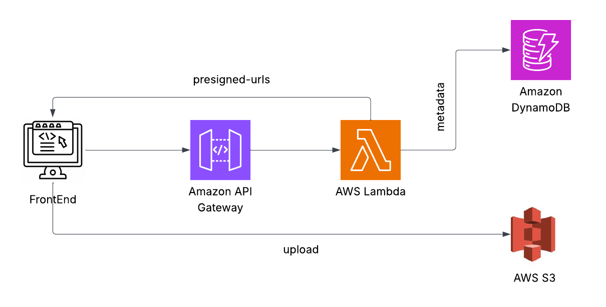

# fileO 

fileO is a simple cloud storage backend built with FastAPI that supports uploading, listing, and deleting files (images, videos, documents). It can run in Local Mode (your laptop) or Cloud Mode (AWS Lambda + S3 + DynamoDB + API Gateway).

### Architecture


## Modes

### Local Mode

Runs FastAPI on your machine.

- Files are uploaded to AWS S3
- Metadata is written to DynamoDB
- The server runs normally using Uvicorn

Start locally:

```bash
uvicorn main:app --reload
```

### Cloud Mode

Refer to [Cloud Setup](cloud_setup.md)

Runs inside AWS Lambda using `Mangum`.

- Triggered by API Gateway
- Same endpoints, same behavior
- No server or VM needed

## API Endpoints

### GET /

Health check.

### POST /login

Authenticates the user.

**Body:**
- `email`
- `password`

**Returns:**
- JWT token

### GET /me

Checks token and returns logged-in user.

**Header:**
```
Authorization: Bearer <token>
```

### POST /upload

Generates S3 presigned URLs to upload files directly from the browser.

**Body:**
- List of files (name + MIME type)

**Returns:**
- Presigned S3 URLs
- S3 keys stored in DynamoDB

### GET /photos

Returns all files uploaded by the user.

**Header:**
```
Authorization: Bearer <token>
```

Each item includes:
- `docId`
- `s3Key`
- `fileType`
- `mimeType`
- `uploadedAt`

### DELETE /delete/{docId}

Deletes the file from S3 and DynamoDB.

**Header:**
```
Authorization: Bearer <token>
```

## `.env` Configuration

### Required for BOTH Local Mode & Cloud Mode

```env
BUCKET_NAME=your-s3-bucket
DDB_TABLE=your-dynamodb-table

JWT_SECRET=your-secret-key
TOKEN_EXPIRE_MINUTES=43200

AWS_REGION=ap-south-1
```

### Only for Local Mode (when you run on your machine)

```env
AWS_ACCESS_KEY_ID=your-local-access-key
AWS_SECRET_ACCESS_KEY=your-local-secret-key
```

(Cloud Mode uses IAM Role instead — no keys needed.)

## AWS Setup (Cloud Mode)

### 1. Create an S3 Bucket

- Use bucket name from `.env`
- No public access required (presigned URLs work privately)

### 2. Create DynamoDB Table

Table name = `DDB_TABLE`.

**Keys:**
- Partition Key → `userId` (String)
- Sort Key → `uploadedat` (Number)

### 3. Deploy to AWS Lambda

- Zip your project and dependencies
- Upload to Lambda
- Set environment variables from `.env` (without AWS keys)
- Add API Gateway → HTTP API

### 4. Give Lambda permission to use S3 + DynamoDB

IAM role must include:
- `AmazonS3FullAccess`
- `AmazonDynamoDBFullAccess`

(or custom minimal role)

## Local Mode Setup

1. Install dependencies:

```bash
pip install -r requirements.txt
```

2. Create `.env` file with AWS keys included.

3. Run FastAPI server:

```bash
uvicorn main:app --reload
```

4. Access:

```
http://localhost:8000
```

## Cloud Mode Setup

1. Remove AWS keys from `.env`
2. Deploy Lambda + API Gateway
3. Set environment variables
4. Access the cloud API URL:

```
https://<api-id>.execute-api.ap-south-1.amazonaws.com
```

## Frontend Setup

Set the API base URL based on mode:

**Local Mode:**

```javascript
const API_BASE = "http://localhost:8000";
```

**Cloud Mode:**

```javascript
const API_BASE = "https://<api-id>.execute-api.ap-south-1.amazonaws.com";
```
